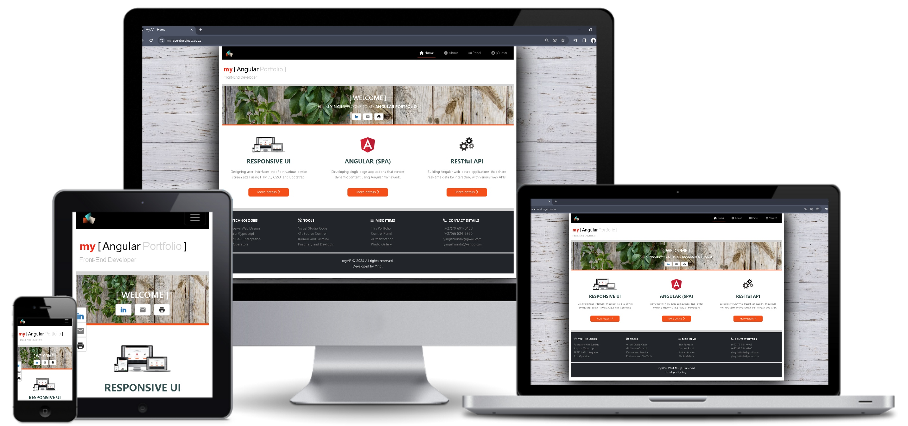

# my [Angular] Portfolio

## Introduction
**my [ Angular ] Portfolio** is a Single-Page Application (SPA) developed with **Angular 2+** javascript framework, with the objective to showcase or to demonstrate practical __Front-End Development__ skills.

> Online :  [  [my Angular Portfolio](https://myrecentprojects.co.za/ "my [ Angular Portfolio ]") ]

## Design

## Description

__my [ Angular ] Portfolio__ is a personal Front-End Development project built with **Angular 2+** framework. The objective is to showcase technical/practical Front-End Problem-solving skills using Angular. The project covers topics related to Angular **Forms**, Implementation of various **Authentication** and **Authorization** mechanisms, **RESTful API** Services Integration and the  Integration of various Angular **Plugins** and **Libraries**.

## Project Scope

The project covers the following Front-End Development fundamentals:

- Implementing Resposive Web Design Principles.
- Building Single-Page Application usnign Angular/Typescript.
- Writing code that is Clean, Reable, Reusable, and Testable
- RESTful API Integration.
- Unit Testing.
- Git & GitHub Source Control.
- and Documentation.

> All features developed in this project are accessible in the [ [cPanel](https://myrecentprojects.co.za/cpanel/ "Portfolio Dashboard") ]  of the portfolio.

## Programming Tools and Environment

| Tool                              | Version                           | Description 
|-----                              |-----------                        |------------
| Windows 10                        | Enterprise (64 bit)               | PC Operation System.  |
| Visual Studion Code               | 1.85.1                            | Integrated Development Environment (IDE).|
| Angular CLI                       | 16.2.2                           | Tool used to initialize, develop, scaffold, and maintain Angular applications.|
| Postman                           | 10.21.0                          | Platform for testing API requests and responses. |
| Git Bash and GitHub               | 2.39.1 (Windows)                 | Version control system for tracking source code changes. |
| DevTools              | 120.0.6099.200 (Official Build) (64-bit)                | Set of Google Chrome browser tools built to assist developer debug error faster. |

